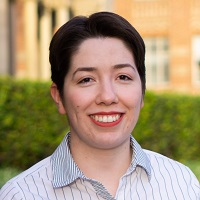
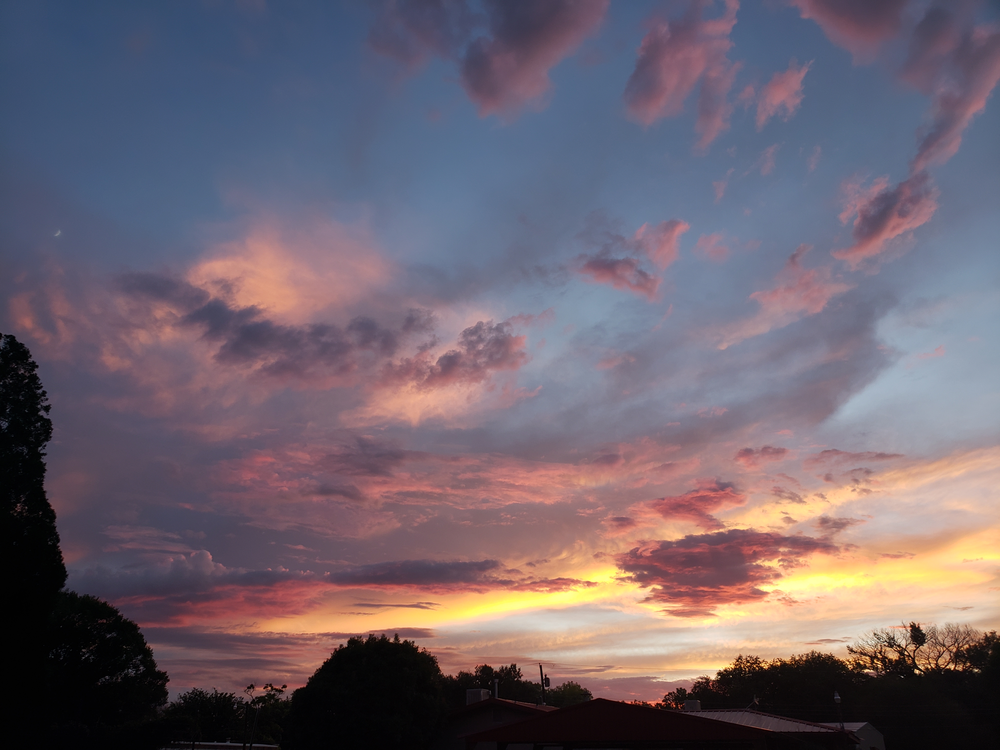

# Hello!
I am Veronica Dike, and I am an astrophysicist!

e-mail: vdike (at) astro (dot) ucla (dot) edu  
ORCID: [0000-0002-9993-3796](https://orcid.org/0000-0002-9993-3796)  
GitHub: [vdike](https://github.com/vdike)

I am from Los Lunas, New Mexico and got my BS in Astrophysics from the University of New Mexico. I received my Masters and PhD from the University of California Los Angeles. I am now a postdoctoral researcher at the University of Illinois Urbana-Champaign. My current research interest is in observational cosmology. 

---

---

I am not on social media. Please contact me via e-mail if you are intested in my research.

