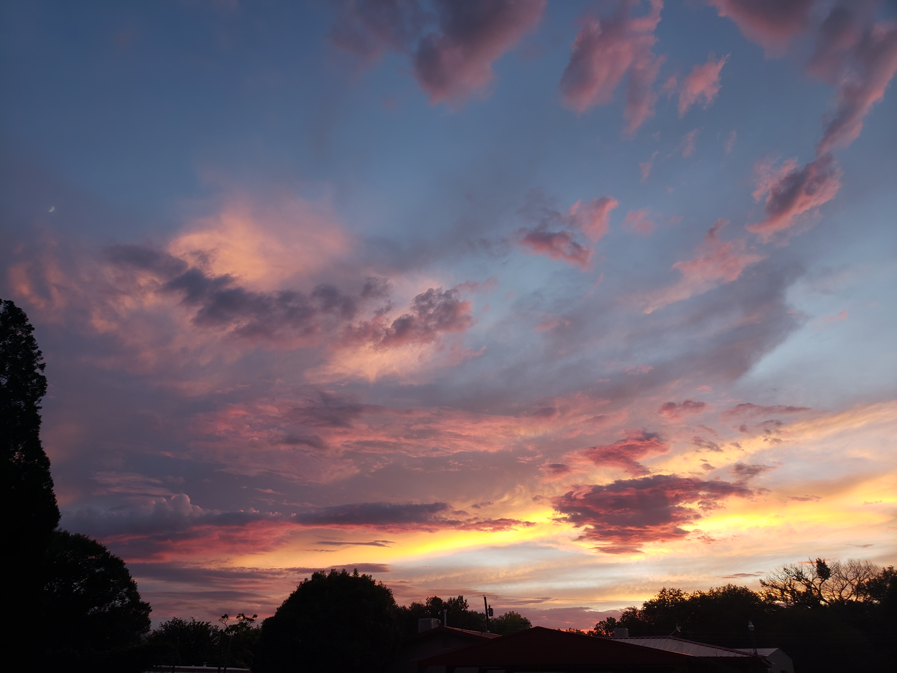

# Hello!
I am Veronica Dike, and I am an astrophysicist!

e-mail: veronica.j.dike (at) gmail (dot) com  
GitHub: [vdike](https://github.com/vdike)
See all my publications on ORCID: [0000-0002-9993-3796](https://orcid.org/0000-0002-9993-3796)  

I am from Los Lunas, New Mexico and got my BS in Astrophysics from the University of New Mexico. I received my Masters and PhD from the University of California Los Angeles. 

---

---

I am not on social media. Please contact me via e-mail if you are intested in my research.

